# Bestiary

**A card-collection layer for Old School RuneScape.** Every monster you kill has a chance to be
**captured** as a collectible card — with a rarity, rolled stats, and the monster's real
Hitpoints — building a personal bestiary you can browse, showcase, reroll and export.

<p align="center">
  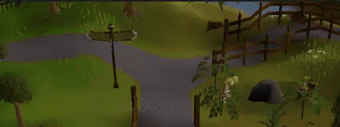<br>
  <em>Kill a monster → roll to capture it → rank up your Capture Level. It all plays out on screen.</em>
</p>

---

## The panel

A sidebar panel is your home base: live stats (Level, Kills, Species, Caught), quick links to the
Album, Favourites and Catch Rates, and tabs for your Cards, the Shop and your Progress.

<p align="center">
  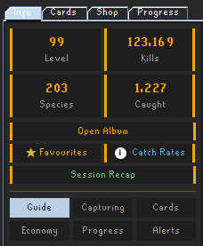
</p>

## Cards

Each capture is a card. A weighted **rarity** (Common → Mythic) and an independent **shiny** roll
decide how good it is: higher rarities lift every stat toward 99, and a card's headline **Power
Level** blends its seven rolled stats with the monster's factual Hitpoints and combat level, so
bosses tower over trash mobs. Same monster, wildly different cards:

<table align="center">
  <tr>
    <td align="center">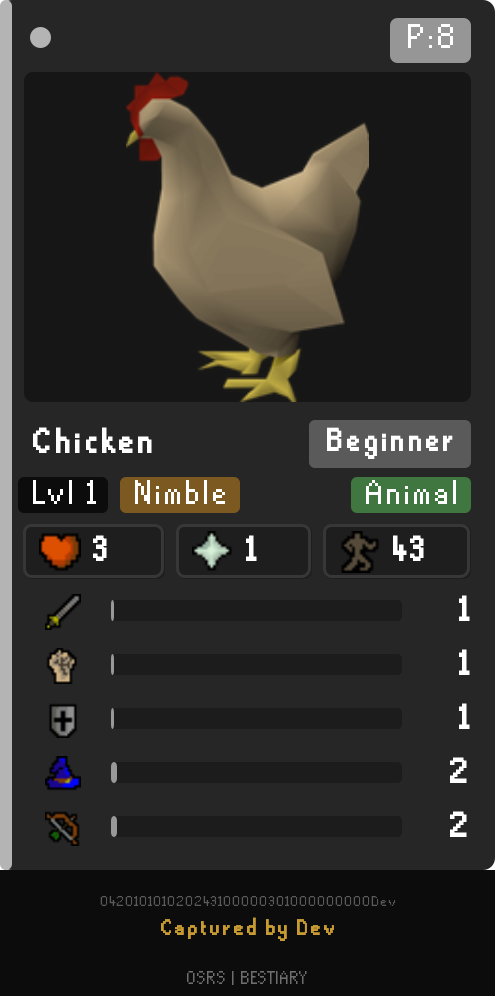<br><em>Common — Power 8</em></td>
    <td align="center">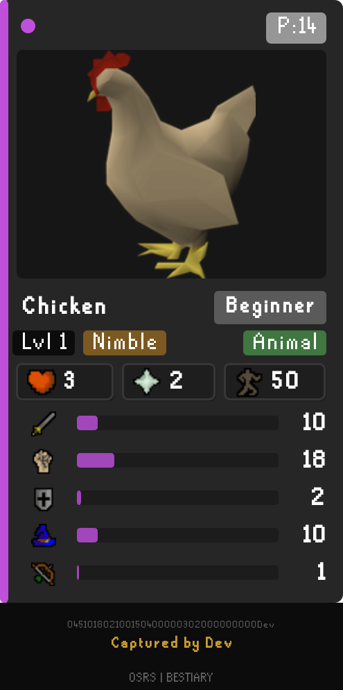<br><em>Epic — Power 14</em></td>
    <td align="center">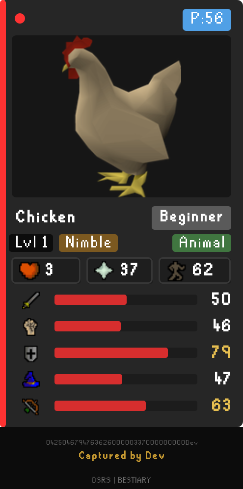<br><em>Mythic — Power 56</em></td>
  </tr>
</table>

Every card carries its full stat spread, HP, Prayer, combat class and species, a unique ID and an
owner stamp — and can be exported as an image to copy or share.

## Album

The album is a catalogue of all tracked monsters (200+). Search it, filter by difficulty tier or
species, sort it, and open any monster for its detail page and all your captures of it. Duplicates
can be discarded for credits, and cards transferred between your own accounts.

<p align="center">
  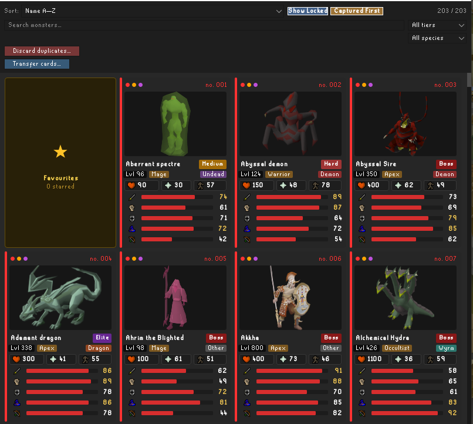
</p>

## Progression, dashboards & economy

A **Capture Level** (1–99, with virtual levels beyond) grows from kill and capture XP, unlocking
achievements along the way — all shown on the **Progress** tab. Captures also earn **Bestiary
Credits** you spend in the **Shop** on passive upgrades and the **Card Reroller**. Shareable
dashboards break down your progression, economy, species completion and best captures.

<table align="center">
  <tr>
    <td align="center">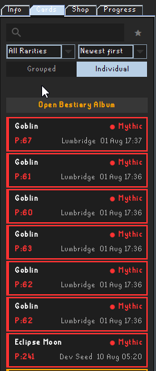<br><em>Cards tab</em></td>
    <td align="center">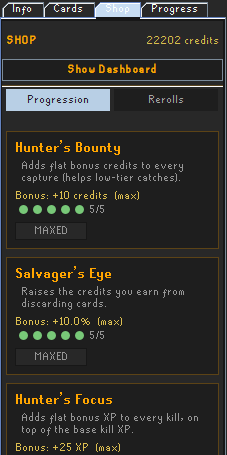<br><em>Shop</em></td>
    <td align="center">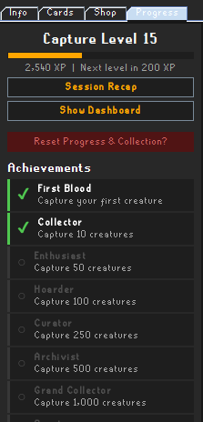<br><em>Progress tab</em></td>
  </tr>
</table>

<p align="center">
  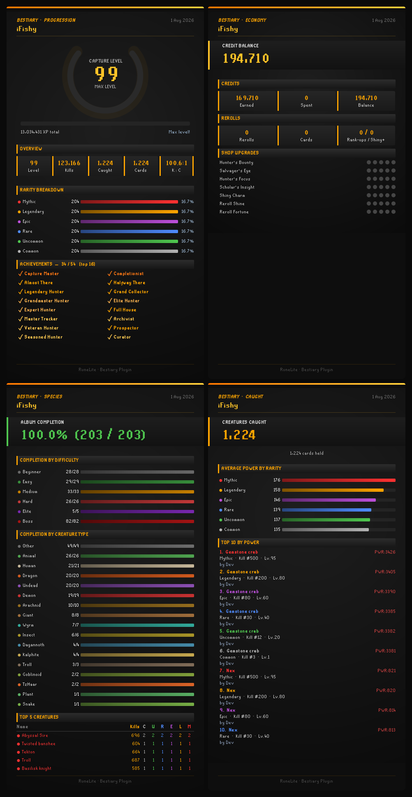
</p>

## Capture rates

Catch chance depends on the monster's difficulty tier and your Capture Level; rarity is a separate
roll that also improves as you level. The Info tab spells it all out — including the max rates —
and it climbs steeply as you grow. A level 1 hunter versus a level 52 one:

<table align="center">
  <tr>
    <td align="center">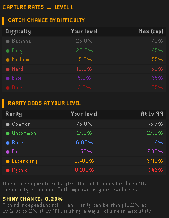<br><em>Level 1</em></td>
    <td align="center">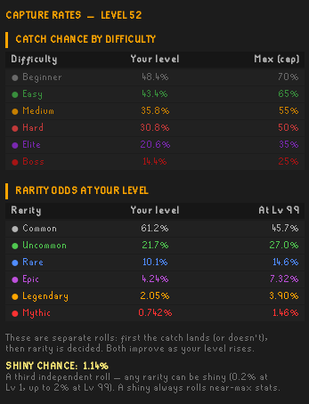<br><em>Level 52</em></td>
  </tr>
</table>

## Features at a glance

Core mechanics:

- **Capture cards on kill** — a catch roll by difficulty tier and Capture Level, then a weighted
  rarity plus an independent shiny roll.
- **Power Level** — a card's headline number: its seven rolled stats plus the monster's factual
  Hitpoints and combat level (at reduced weight), so bosses outclass trash mobs.
- **Overlay & chat notifications** — an on-screen capture animation, level-up banners, and
  configurable chat messages.

Tabs & views:

- **Cards tab** — your collection grouped by rarity or monster, or a flat individual list, plus
  favourites; rich detail dialogs with per-stat bands and personal bests.
- **Album** — a searchable, filterable grid of every known monster, with per-monster detail pages
  and paginated capture views.
- **Shop** — spend Bestiary Credits (earned per capture) on passive upgrades and the Card Reroller.
- **Progress tab** — a Capture Level (1–99, with virtual levels), XP from kills and captures, and
  achievements.

Screens & tools (each opens its own window):

- **Catch Rates** — per-difficulty catch and rarity chances at your current Capture Level.
- **Card Info** — a per-card breakdown: Overview, Odds, a percentile/reroll Graph, and reroll history.
- **Card Reroller** — re-roll a card's stats/shiny for credits, with an odds breakdown and a
  before/after result (shiny stays shiny).
- **Card export** — save or copy any card, or a whole album page, as an image with a unique ID and
  owner stamp.
- **Discard duplicates** — turn spare cards into credits.
- **Transfer cards** — move cards between your own accounts via a searchable picker.
- **Dashboards** — Progression, Economy, Species and Caught breakdowns, exportable as images.
- **Session Recap** — a shareable per-session summary of XP and credits gained.
- **Reset Progress & Collection** — wipe everything and start over (double-confirmed).
- **About** — plugin info and version.

Accounts:

- **Multiple accounts** — each account keeps its own collection; browse any known account read-only.

## Data & privacy

- Your collection is stored locally as JSON in `~/.runelite/bestiary/`.
- The plugin makes **no network requests by default**. Enabling **"Fetch NPC images from the Wiki"**
  (off by default) downloads monster artwork from the OSRS Wiki (`oldschool.runescape.wiki`) — only
  the monster's name is requested, no account or personal data is sent, and images are cached to disk.

## Building

A standard RuneLite external plugin, built with Gradle (targets Java 11 bytecode; a JDK 11+ is
required — the Gradle wrapper downloads Gradle itself).

```
./gradlew build        # compile + run tests
./gradlew run          # launch a from-source RuneLite client with the plugin (developer mode)
./gradlew shadowJar    # build a sideloadable jar in build/libs/
```

`./gradlew run` is the easiest way to try it: log in and open the Bestiary panel from the sidebar.
The `[DEV]` helper buttons and the Developer Tools config only appear in developer mode.

## Project layout

```
src/main/java/com/bestiary/
  BestiaryPlugin      — event wiring, kill → capture flow
  BestiaryConfig      — user-facing settings
  model/              — CapturedCreature, BestiaryCollection, CreatureRarity, MonsterRoster, ...
  service/            — CaptureService, ProgressionService, BestiaryDataService,
                        BestiaryStore (JSON persistence), WikiImageService, KillTracker
  ui/                 — Swing panels and dialogs (BestiaryPanel, CollectionTab, Album, InfoTab, ...)
  util/               — RarityRoller, OddsCalculator, XpTable, CardId, RegionNames
```

## Licence

BSD 2-Clause — see [LICENSE](LICENSE).
